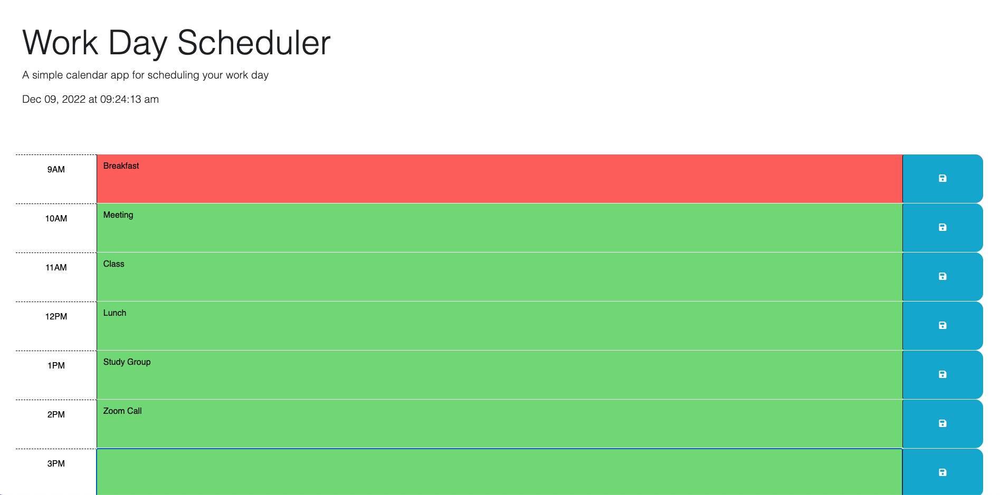

# make-my-day

## Description

This workday scheduler application, aptly named "make-my-day," features dynamically updated HyperText Markup Language (HTML) and Cascading Style Sheet (CSS) powered by the third party Application Programming Interface (API), jQuery. In this application, the user can view the updated, current date and time, as well as time-blocks for the day from 9:00 AM - 5:00 PM. Each time-block is color coded to indicate whether it is in the past, present, or future, and this feature dynamically updates with the current time. When the user clicks on a time block, they are able to type in text, and when the user clicks the save button, this text is saved within the time block. Each saved text entry persists page refresh and is viewable upon page reload.

## Screenshot

## Link to webpage:

https://saramangelo.github.io/make-my-day/

## License

MIT License

Copyright (c) 2022 saramangelo

Permission is hereby granted, free of charge, to any person obtaining a copy
of this software and associated documentation files (the "Software"), to deal
in the Software without restriction, including without limitation the rights
to use, copy, modify, merge, publish, distribute, sublicense, and/or sell
copies of the Software, and to permit persons to whom the Software is
furnished to do so, subject to the following conditions:

The above copyright notice and this permission notice shall be included in all
copies or substantial portions of the Software.

THE SOFTWARE IS PROVIDED "AS IS", WITHOUT WARRANTY OF ANY KIND, EXPRESS OR
IMPLIED, INCLUDING BUT NOT LIMITED TO THE WARRANTIES OF MERCHANTABILITY,
FITNESS FOR A PARTICULAR PURPOSE AND NONINFRINGEMENT. IN NO EVENT SHALL THE
AUTHORS OR COPYRIGHT HOLDERS BE LIABLE FOR ANY CLAIM, DAMAGES OR OTHER
LIABILITY, WHETHER IN AN ACTION OF CONTRACT, TORT OR OTHERWISE, ARISING FROM,
OUT OF OR IN CONNECTION WITH THE SOFTWARE OR THE USE OR OTHER DEALINGS IN THE
SOFTWARE.
